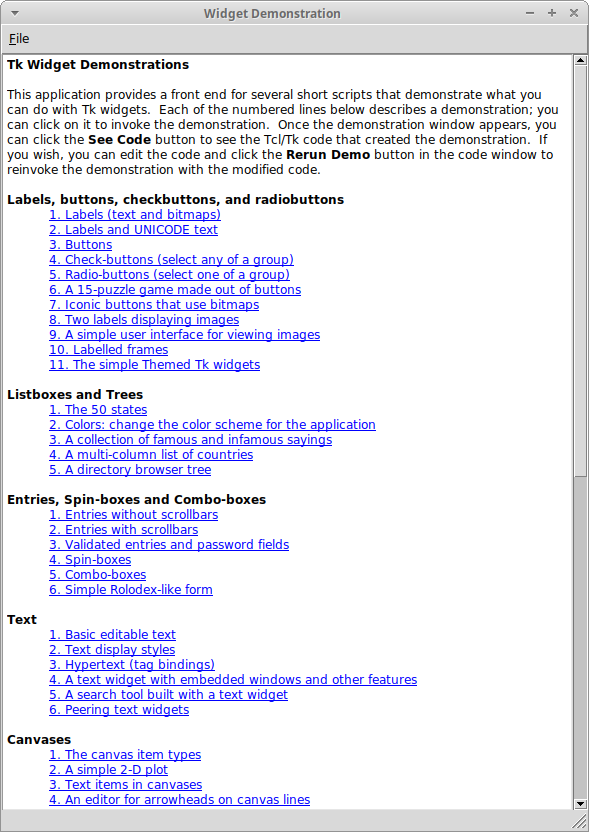

# Statcl

A μ [Tcl/Tk](https://www.tcl.tk) distribution statically linked to put in an [AppImage](https://appimage.org).

[](https://travis-ci.com/julien-montmartin/statcl)

Sources are compiled by Travis CI on Ubuntu Trusty (14.04), according to AppImage [recommendations](https://docs.appimage.org/packaging-guide/distribution.html). The files of this repository are released under the BSD-3-Clause license. Individual packages of Statcl are also released under BSD-type license:

- Tcl/Tk, tcllib and tklib [license](https://wiki.tcl-lang.org/page/license)
- TkCon [license](http://tkcon.sourceforge.net/docs/license.terms)

Feel free to go to the [release tab](https://github.com/julien-montmartin/statcl/releases/latest) of this repo, and download the latest AppImage of the Wish demo. You may also want to check my [disk free demo](https://github.com/julien-montmartin/statcl-df-demo) for an easy example of a working AppImage based on Statcl.

<p align="center"></p>

This kind of `sh` script may help you to download the latest release of Statcl from this repo:

```bash
getStatcl() {

	curlTxt=https://raw.githubusercontent.com/julien-montmartin/statcl/master/curl.txt
	curl -s ${curlTxt} | curl -sLK -
	ls -lh statcl-*
}
```
